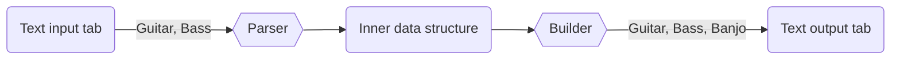

# Tablature converter

CLI nástroj na převod ASCII reprezentace tabulatury pro hudební nástroje.
Uživatel zadá vstupní soubor s tabulaturou, jméno výstupního souboru,
vstupní nástroj a výstupní nástroj přibližně jako:

```
$ tabconv -i guitar_input.tab -o banjo_output.tab --parser guitar --builder banjo
```

Program se pokusí zpracovat vstupní tabulaturu a následně ji převést na zadaný nástroj.

Program bude podporovat více nástrojů jak pro vstup tak pro výstup a možnost konfigurace nástroje na jiné ladění. Také bude podporovat transpozici tabulatury.

Vstupní (jiné tabulatury se vlastně nepíšou):
- Kytara
- Basa

Výstupní (možná i další):
- Kytara
- Basa
- Banjo

## Architektura



## Příklad

Vstupní tabulatura pro kytaru:
```
e|---------------------------------------------------------------------------|
B|---------------------------------------------------------------------------|
G|---------------------------------------------------------------------------|
D|-------------0-3-------------3-2-------------0-5-3-2-0---0-2-3-------------|
A|-------0-2-3-----------0-2-3-----------0-2-3-----------3---------0-2-3-(0)-|
E|-0-1-4-----------0-1-4-----------0-1-4-------------------------4-----------|
```

Výstupní tabulatura pro banjo:
```
d|-------------0-3-------------3-2-------------0---3-2-0---0-2-3-------------|
B|---------0-1-------------0-1-------------0-1-----------1-----------0-1-----|
G|-----1-2-------------1-2-------------1-2-----------------------1-2-----(2)-|
D|-2-3-------------2-3-------------2-3---------------------------------------|
g|-----------------------------------------------0---------------------------|
```


## Algoritmus

Algoritmus možná bude muset být specializovaný pro nějaké nástroje, obecně ale bude chod přibližně takový:

Vstup:
```
e|-------------------------|
B|-------------------------|
G|---------1---------------|
D|-------------0/3---------|
A|-------0-2-3---------(0)-|
E|-0-1---------------------|
```

1. Vstup se rozdělí na logické kusy hudby a zaznamená se jejich (horizontální) pozice v tabulatuře:
	- `E 0` - na pozici 1
	- `E 1` - na pozici 3
	- `A 0` - 7
	- `A 2` - 9
	- `G 1` - 9
	- `A 3` - 11
	- `D 0/3` - 13 (zůstává pospolu, protože slide `/` se musí hrát na stejné struně)
	- `A (0)` - 21

2. Každý logický kus (to je samotný tón, i posloupnost) se převede z kytarové reprezentace (nebo jiného nástroje) na obecnou reprezentaci tónu (pravděpodobně jako počet půltónu od `C_0`, ale v příkladu použijeme jména tónů). Techniky jako `/` budou také oddělené od tónů.
	- `E_2` - 1
	- `F_2` - 3
	- `A_2` - 7
	- `B_2` - 9
	- `G#_3` - 9
	- `C_3` - 11
	- `D_3`, `/`, `F_3` - 13 (reprezentováno jako pole)
	- `(`, `A_2`, `)` - 21

3. Pole všech těchto kusů se seřadí a seskupí podle pozice v tabulatuře vzestupně (takže pole je seřazené podle toho kdy se tón/sekvence hraje)
	1. `E_2`
	2. `F_2`
	3. `A_2`
	4. `B_2` a `G#_3` (Hrají se oba zároveň)
	5. `C_3`
	6. `D_3`, `/`, `F_3` (Hrají se postupně ale na jedné struně, v případě strunného nástroje)
	7. `(`, `A_2`, `)`

4. Program hladově vymyslí držení na jiném nástroji. (Struna, např. `D_3`, program spočítá na kterém pražci se tón dá zahrát, např. `F_3` lze zahrát na banjo struně `D_3` na pražci `3`, jelikož jsou od sebe o $+3$ půltóny). Při více možnostech kde hrát tón bude program preferovat hraní tónu na nižším pražci. (heuristika). Jelikož `E_2` nelze na banjo zahrát vůbec, tak se všechny tóny transponují o oktávu výš.
	1. `D 2` - 1
	2. `D 3` - 3
	3. `G 2` - 5
	4. `B 0` - 7
	5. `d 6` - 7
	6. `B 1` - 9
	7. `d 0/3` - 11
	8. `G (2)` - 13

5. Převod na human readable tabulaturu

Výstup:

```
d|-------6---0/3-----|
B|-------0-1---------|
G|-----2---------(2)-|
D|-2-3---------------|
g|-------------------|
```
