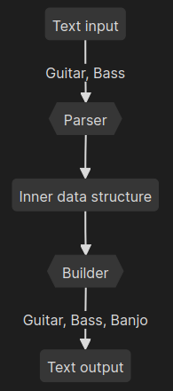

# Tabulature converter

CLI nástroj na převod ASCII reprezentace tabulatury pro nástroje.
Uživatel zadá vstupní soubor s tabulaturou, jméno výstupního souboru,
vstupní nástroj a výstupní nástroj přibližně jako:

```
$ tabconv -i guitar_input.tab -o banjo_output.tab --parser guitar --builder banjo
```

Program se pokusí zpracovat vstupní tabulaturu a následně ji převést na zadaný nástroj.

Program bude podporovat více nástrojů jak pro vstup tak pro výstup.

Vstupní (jiné tabulatury se vlastně nepíšou):
- Kytara
- Basa
 
Výstupní (možná i další):
- Kytara
- Basa
- Banjo

## Architektura




## Příklad

Vstupní tabulatura pro kytaru:
```
e|---------------------------------------------------------------------------|
B|---------------------------------------------------------------------------|
G|---------------------------------------------------------------------------|
D|-------------0-3-------------3-2-------------0-5-3-2-0---0-2-3-------------|
A|-------0-2-3-----------0-2-3-----------0-2-3-----------3---------0-2-3-(0)-|
E|-0-1-4-----------0-1-4-----------0-1-4-------------------------4-----------|
```

Výstupní tabulatura pro banjo:
```
d|-------------0-3-------------3-2-------------0---3-2-0---0-2-3-------------|
B|---------0-1-------------0-1-------------0-1-----------1-----------0-1-----|
G|-----1-2-------------1-2-------------1-2-----------------------1-2-----(2)-|
D|-2-3-------------2-3-------------2-3---------------------------------------|
g|-----------------------------------------------0---------------------------|
```
